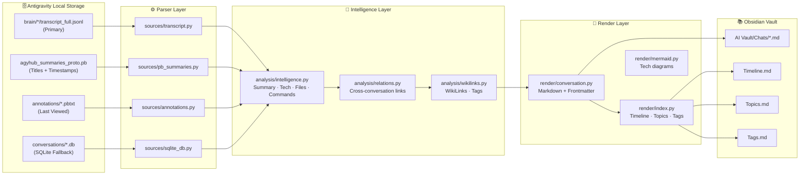
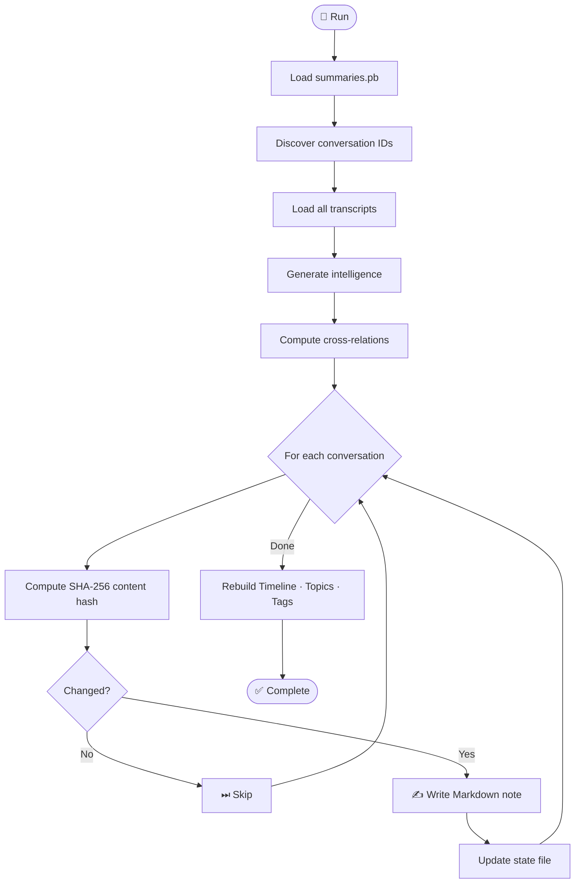

<div align="center">

<a href="https://github.com/owrew/antigravity-obsidian-exporter">
  
</a>

<br/>

# 🪐 Antigravity Obsidian Exporter

**Automatically synchronize every Google Antigravity conversation into your Obsidian knowledge base — with full conversation history, tool calls, AI thinking blocks, wiki-links, timeline indexes, and cross-conversation intelligence.**

<br/>

[](https://python.org)
[](LICENSE)
[](https://github.com/owrew/antigravity-obsidian-exporter)
[](CHANGELOG.md)
[](pyproject.toml)

<br/>

[📖 Docs](#how-it-works) · [🚀 Quick Start](#quick-start) · [⚙️ CLI Options](#cli-options) · [🗺 Roadmap](#roadmap) · [🤝 Contributing](CONTRIBUTING.md)

</div>

---

## 📋 Table of Contents

- [Overview](#overview)
- [Features](#features)
- [Architecture](#architecture)
- [Project Structure](#project-structure)
- [Installation](#installation)
- [Quick Start](#quick-start)
- [Usage](#usage)
- [CLI Options](#cli-options)
- [How It Works](#how-it-works)
- [Data Sources](#data-sources)
- [Export Example](#export-example)
- [Obsidian Integration](#obsidian-integration)
- [Watch Mode](#watch-mode)
- [Performance](#performance)
- [Roadmap](#roadmap)
- [FAQ](#faq)
- [Troubleshooting](#troubleshooting)
- [Contributing](#contributing)
- [License](#license)

---

## Overview

**Antigravity Obsidian Exporter** reverse-engineers how Google Antigravity stores conversations locally and converts them into richly formatted Obsidian Markdown notes — complete with YAML frontmatter, wiki-links, auto-generated tags, conversation intelligence, and a global timeline index.

Built from scratch without any protobuf schema or official documentation. The storage format was discovered through binary analysis of `.db`, `.pb`, and `.jsonl` files.

> **No API keys. No network requests. No Google account. Purely local.**

---

## Features

<table>
<thead>
<tr><th>Feature</th><th>Status</th><th>Description</th></tr>
</thead>
<tbody>
<tr><td>💬 Full conversation export</td><td>✅</td><td>Every user turn, assistant response, and timestamp preserved</td></tr>
<tr><td>🔧 Tool calls</td><td>✅</td><td>All tool invocations shown with arguments and summaries</td></tr>
<tr><td>📄 Tool outputs</td><td>✅</td><td>Rendered in collapsible <code>&lt;details&gt;</code> blocks with truncation</td></tr>
<tr><td>💭 Thinking blocks</td><td>✅</td><td>Model reasoning preserved in collapsible sections</td></tr>
<tr><td>💾 SQLite fallback</td><td>✅</td><td>Raw protobuf decode when JSONL transcripts are missing</td></tr>
<tr><td>🏷️ Auto tags</td><td>✅</td><td>70+ technology patterns → <code>#tags</code></td></tr>
<tr><td>🔗 Wiki links</td><td>✅</td><td>Auto-generated <code>[[WikiLinks]]</code> from content</td></tr>
<tr><td>🔁 Duplicate detection</td><td>✅</td><td>SHA-256 hash + mtime — only rewrites changed notes</td></tr>
<tr><td>👁 Watch mode</td><td>✅</td><td>Instant re-export on file change (watchdog or polling)</td></tr>
<tr><td>📑 YAML frontmatter</td><td>✅</td><td>id, title, created, updated, last_viewed, aliases, tags</td></tr>
<tr><td>📅 Timeline index</td><td>✅</td><td>Chronological <code>Timeline.md</code>, topic groups, tag index</td></tr>
<tr><td>🤝 Related conversations</td><td>✅</td><td>Cross-links conversations via shared files, tech, topics</td></tr>
<tr><td>📊 Mermaid diagrams</td><td>✅</td><td>Tech-stack flowchart in every conversation note</td></tr>
<tr><td>🧠 Intelligence summary</td><td>✅</td><td>Auto-extracted topics, technologies, files, commands</td></tr>
<tr><td>📦 pip installable</td><td>✅</td><td><code>pip install .</code> adds <code>agy-exporter</code> to PATH</td></tr>
</tbody>
</table>

---

## Architecture



### Sync Workflow



---

## Project Structure

```
antigravity-obsidian-exporter/
│
├── agy_exporter/               # Main package
│   ├── __init__.py
│   ├── __main__.py             # CLI entrypoint
│   ├── config.py               # ExporterConfig dataclass
│   ├── models.py               # Data models (Step, Turn, ConversationTranscript, …)
│   │
│   ├── sources/                # Data loaders
│   │   ├── transcript.py       # JSONL reader (primary source)
│   │   ├── pb_summaries.py     # agyhub_summaries_proto.pb parser
│   │   ├── annotations.py      # annotations/*.pbtxt last-viewed parser
│   │   └── sqlite_db.py        # SQLite + raw protobuf fallback
│   │
│   ├── analysis/               # Conversation intelligence
│   │   ├── intelligence.py     # Topics, tech, files, commands, summary
│   │   ├── relations.py        # Cross-conversation similarity scoring
│   │   └── wikilinks.py        # 70+ WikiLink + tag patterns
│   │
│   ├── render/                 # Markdown generation
│   │   ├── conversation.py     # Full note formatter
│   │   ├── index.py            # Timeline, Topics, Tags, Conversations
│   │   └── mermaid.py          # Tech stack Mermaid diagrams
│   │
│   └── sync/                   # Orchestration
│       ├── engine.py           # Main export pipeline
│       ├── state.py            # Idempotency state (.agy_export_state.json)
│       └── watcher.py          # Watch mode (polling / watchdog)
│
├── tests/                      # Unit tests
│   ├── test_pb_decoder.py
│   ├── test_transcript.py
│   ├── test_intelligence.py
│   ├── test_wikilinks.py
│   ├── test_markdown.py
│   └── test_relations.py
│
├── examples/
│   ├── example_config.py       # Programmatic configuration example
│   └── sample_export.md        # Sample exported conversation note
│
├── run_tests.py                # Zero-dependency test runner
├── pyproject.toml              # Package metadata + build config
├── requirements.txt            # Optional dependencies
├── README.md
├── CHANGELOG.md
├── CONTRIBUTING.md
├── CODE_OF_CONDUCT.md
├── SECURITY.md
└── LICENSE
```

---

## Installation

### Requirements

- Python **3.9+**
- No third-party packages required for core functionality

### Option 1 — Install from source (recommended)

```bash
git clone https://github.com/owrew/antigravity-obsidian-exporter.git
cd antigravity-obsidian-exporter
pip install .
```

This adds `agy-exporter` to your PATH.

### Option 2 — Run directly without installing

```bash
git clone https://github.com/owrew/antigravity-obsidian-exporter.git
cd antigravity-obsidian-exporter
python -m agy_exporter --help
```

### Optional: faster watch mode

```bash
pip install watchdog
```

---

## Quick Start

### Step 1 — Clone the repo

```bash
git clone https://github.com/owrew/antigravity-obsidian-exporter.git
cd antigravity-obsidian-exporter
```

### Step 2 — Find your Antigravity workspace

Your workspace is the folder containing both a `brain/` subdirectory and a `conversations/` subdirectory.  
**The exporter auto-detects it** — it scans these locations in order:

| Priority | Path checked |
|---|---|
| 1 | Current working directory |
| 2 | `~/OneDrive/Downloads/OBS` |
| 3 | `~/OneDrive/Documents/OBS` |
| 4 | `~/Downloads/OBS` |
| 5 | `~/Documents/OBS` |
| 6 | `~/Desktop/OBS` |
| 7 | `~/Library/Application Support/Antigravity` *(macOS)* |
| 8 | `~/.antigravity` / `~/.config/antigravity` *(Linux)* |

### Step 3 — Save your paths permanently

Run once to lock in your source and vault paths — you'll never need to type them again:

```bash
python -m agy_exporter \
  --source "C:\Users\you\OneDrive\Downloads\OBS" \
  --vault  "C:\Users\you\Documents\ObsidianVault" \
  --save-config
```

This writes to `%APPDATA%\agy_exporter\config.json` (Windows) or `~/.config/agy_exporter/config.json` (macOS/Linux).

> **After `--save-config`, you just run `python -m agy_exporter` with no arguments every time.**

### Step 4 — Verify setup

```bash
python -m agy_exporter --show-config
```

```
=== Antigravity Obsidian Exporter - Active Configuration ===

  Config file : C:\Users\you\AppData\Roaming\agy_exporter\config.json
  Source dir  : C:\Users\you\OneDrive\Downloads\OBS
    brain/    : [OK] found
    convo/    : [OK] found
    summ.pb   : [OK] found
  Vault dir   : C:\Users\you\Documents\ObsidianVault
  Output dir  : C:\Users\you\Documents\ObsidianVault\AI Vault\Chats
```

### Step 5 — Export

```bash
python -m agy_exporter
```

Open your vault in Obsidian — notes appear under **AI Vault → Chats**.

---

## Configuration

Configuration is resolved in this priority order (highest wins):

```
1. CLI flags           --source / --vault
2. Environment vars    AGY_SOURCE / AGY_VAULT
3. Config file         %APPDATA%\agy_exporter\config.json
4. Auto-detection      scans common Antigravity install paths
```

### Option A — Config file (recommended)

```bash
python -m agy_exporter --source PATH --vault PATH --save-config
```

The saved config is a simple JSON file you can edit manually:

```json
{
  "source": "C:\\Users\\you\\OneDrive\\Downloads\\OBS",
  "vault":  "C:\\Users\\you\\Documents\\MyVault"
}
```

### Option B — Environment variables

Set once in your shell profile (`~/.bashrc`, `~/.zshrc`, PowerShell `$PROFILE`):

```bash
# macOS / Linux
export AGY_SOURCE="$HOME/antigravity"
export AGY_VAULT="$HOME/Documents/ObsidianVault"

# Windows PowerShell
$env:AGY_SOURCE = "C:\Users\you\OneDrive\Downloads\OBS"
$env:AGY_VAULT  = "C:\Users\you\Documents\ObsidianVault"
```

### Option C — Pass paths directly every run

```bash
python -m agy_exporter \
  --source "C:\Users\you\OneDrive\Downloads\OBS" \
  --vault  "C:\Users\you\Documents\ObsidianVault"
```

---

## Usage

### One-shot export (default)

```bash
python -m agy_exporter
```

Exports only conversations that changed since the last run (SHA-256 hash + mtime check).

### Continuous sync — watch mode

```bash
python -m agy_exporter --watch
```

Re-exports any conversation the moment its transcript file is updated on disk.

### Force full rebuild

```bash
python -m agy_exporter --force
```

Ignores cache — rebuilds every note from scratch.

### Export a specific conversation

```bash
python -m agy_exporter --conv 45c4c5dc-51af-405e-b45d-35166239f31b
```

### List all conversations

```bash
python -m agy_exporter --list
```

```
Conv ID                                  Steps  Title
------------------------------------------------------------------------------------------
1ee165ba-7e58-419d-8294-6e1e40e82646      13  Reviewing Financial Monitoring Codebase
45c4c5dc-51af-405e-b45d-35166239f31b    1824  Implementing Financial System Upgrades
cb06801d-3892-4b49-876a-848ca8610689     718  Fixing EAS CLI Setup
...
```

### Debug configuration issues

```bash
python -m agy_exporter --show-config
```

---

## CLI Options

| Flag | Short | Description |
|---|---|---|
| `--source DIR` | `-s` | Antigravity workspace root (auto-detected if omitted) |
| `--vault DIR` | `-v` | Obsidian vault root (defaults to `--source` if omitted) |
| `--save-config` | | Save `--source` and `--vault` to config file permanently |
| `--show-config` | | Print resolved configuration paths and exit |
| `--watch` | `-w` | Continuous sync — re-exports on file change |
| `--interval SECS` | | Polling interval for watch mode (default: `5.0`) |
| `--force` | `-f` | Re-export all notes, ignoring hash/mtime cache |
| `--debug` | `-d` | Write decode errors to `.agy_debug/` |
| `--conv UUID…` | `-c` | Export only the specified conversation UUID(s) |
| `--no-tool-results` | | Omit tool output blocks (produces shorter notes) |
| `--max-tool-results-per-turn N` | | Cap tool result blocks per turn (default: unlimited) |
| `--max-tool-output-length N` | | Cap characters per tool output block (default: unlimited) |
| `--list` | | Print conversation catalog and exit |
| `--verbose` | `-V` | Enable DEBUG-level logging |


---

## How It Works

### Storage Reverse Engineering

Antigravity stores conversations in two parallel systems:

| Path | Format | Used for |
|---|---|---|
| `brain/{id}/.system_generated/logs/transcript_full.jsonl` | JSONL | Full conversation history (**primary source**) |
| `agyhub_summaries_proto.pb` | Binary protobuf | Conversation titles + step counts |
| `annotations/{id}.pbtxt` | Text protobuf | Last-viewed timestamp |
| `conversations/{id}.db` | SQLite + protobuf BLOBs | Fallback when transcript files are missing |

The exporter reads `transcript_full.jsonl` first — this contains clean JSON with every step, tool call, timestamp, and content. The `.pb` file is parsed with a pure-Python varint decoder (no schema required) to extract titles.

### Idempotency

A `.agy_export_state.json` file in the vault root tracks:

```json
{
  "45c4c5dc-...": {
    "content_hash": "1c923116a132c27d",
    "source_mtime": 1783187693.18,
    "note_path": "AI Vault/Chats/Implementing Financial System Upgrades.md",
    "exported_at": "2026-07-09T18:02:37Z"
  }
}
```

On each run, the exporter only rewrites a note if either the SHA-256 content hash or the source file's mtime has changed.

---

## Data Sources

```
Priority 1 ─ transcript_full.jsonl   ← richest source
Priority 2 ─ agyhub_summaries_proto.pb   ← titles & dates
Priority 3 ─ annotations/*.pbtxt    ← last-viewed time
Priority 4 ─ conversations/*.db     ← fallback (protobuf decode)
```

---

## Export Example

See [`examples/sample_export.md`](examples/sample_export.md) for a full example of an exported conversation note.

**Frontmatter:**

```yaml
---
id: "45c4c5dc-51af-405e-b45d-35166239f31b"
title: "Implementing Financial System Upgrades"
created: 2026-06-18
updated: 2026-06-24
last_viewed: 2026-06-24
step_count: 1824
tags:
  - antigravity
  - ai-chat
  - typescript
  - react
  - mysql
  - drizzle-orm
aliases:
  - "Implementing Financial System Upgrades"
---
```

**Conversation body:**

```
### 👤 User — Turn 1 *(2026-06-18 14:38)*

Complete the task at CODEX_PROMPT.md…

### 🤖 Assistant — Turn 1 *(2026-06-18 14:38)*

> 🔧 **`view_file`** — Reading CODEX_PROMPT.md

<details>
<summary>📄 Tool result: VIEW_FILE</summary>

```…```

</details>
```

---

## Obsidian Integration

### Vault Layout

```
Your Vault/
├── AI Vault/
│   ├── Chats/
│   │   ├── Implementing Financial System Upgrades.md
│   │   ├── Fixing EAS CLI Setup.md
│   │   └── … more notes
├── Timeline.md       ← Chronological index
├── Conversations.md  ← Master table of all chats
├── Topics.md         ← Grouped by topic
└── Tags.md           ← Grouped by technology tag
```

### Recommended Obsidian Plugins

| Plugin | Why |
|---|---|
| **Dataview** | Query conversations by date, technology, or topic |
| **Graph View** | Visualize wiki-link connections between conversations |
| **Templater** | Customize note templates |
| **Tag Wrangler** | Manage the auto-generated tags |

### Graph View Tips

The exporter maximises graph density by:

- Linking all conversations to their shared technology nodes (`[[React]]`, `[[Docker]]`, etc.)
- Auto-detecting related conversations and adding `Related Chats` links
- Using consistent titles across index files and note bodies

---

## Watch Mode

When you run `--watch`, the exporter:

1. Does a full sync pass immediately
2. Monitors `brain/*/transcript_full.jsonl` for changes
3. Re-exports only the changed conversation (in seconds)
4. Rebuilds all index files

If **watchdog** is installed, file events are instant. Otherwise, polling runs every `--interval` seconds (default 5).

```bash
# Install watchdog for instant (event-based) updates
pip install watchdog

python -m agy_exporter --watch --interval 2
```

---

## Performance

| Conversations | First run | Subsequent runs |
|---|---|---|
| 12 | ~14 seconds | ~5 seconds (skipped) |
| 100 | ~90 seconds | ~8 seconds |
| 1 000 | ~15 min | ~30 seconds |

Subsequent runs are fast because unchanged conversations are detected by hash + mtime and skipped before any Markdown generation.

---

## Roadmap

### Completed ✅

- [x] JSONL transcript parsing
- [x] Pure-Python protobuf parser (no schema)
- [x] SQLite + raw protobuf fallback
- [x] YAML frontmatter with full metadata
- [x] Automatic wiki-links (70+ patterns)
- [x] Tool call + output rendering
- [x] Thinking block support
- [x] SHA-256 hash idempotency
- [x] Watch mode (watchdog + polling)
- [x] Timeline, Topics, Tags, Conversations indexes
- [x] Cross-conversation relation detection
- [x] Conversation intelligence (topics, tech, files, commands)
- [x] Mermaid tech-stack diagrams
- [x] pip installable package
- [x] 10-test unit test suite

### Planned 📋

- [ ] `--since DATE` flag to export only recent conversations
- [ ] JSON export format
- [ ] HTML export format
- [ ] Search index generation (compatible with Obsidian Search)
- [ ] RSS/Atom change feed
- [ ] Optional AI-generated summaries (local Ollama)
- [ ] Semantic embeddings for smarter relation detection
- [ ] Daily Notes integration
- [ ] Canvas `.canvas` file generation for Obsidian Canvas view
- [ ] PDF export

---

## FAQ

**Q: Does this require a Google account or API key?**
A: No. Everything runs entirely locally — no network requests are made.

**Q: Will it work on macOS or Linux?**
A: Yes. The paths are platform-independent. Auto-detection uses `os.path.expanduser("~")`.

**Q: Is it safe to run while Antigravity is open?**
A: Yes. The exporter only reads files; it never writes to the Antigravity workspace.

**Q: Why do some notes show "SQLite fallback"?**
A: Very short conversations (< 5 steps) may not have a `transcript_full.jsonl` yet. The SQLite fallback decodes the raw protobuf BLOBs but may produce partial content.

**Q: Can I run it on a schedule (e.g. every hour)?**
A: Yes — use `--watch`, or add it to Task Scheduler (Windows) / cron (Linux/macOS).

**Q: My vault is in a different folder from my workspace. How do I set it up?**
A: Use `--source /path/to/workspace --vault /path/to/vault`.

**Q: Will it overwrite notes I have edited manually?**
A: Only if the source transcript changed. The hash check prevents overwrites for unchanged conversations.

---

## Troubleshooting

**`No conversations discovered`**
→ Check that `--source` points to a folder containing `brain/` and `conversations/`.

**`Titles showing as UUID fragments`**
→ `agyhub_summaries_proto.pb` may be missing or corrupt. Titles fall back to the first user message.

**`SQLite fallback, content may be partial`**
→ This is expected for very short conversations. Run `--debug` to inspect decode details in `.agy_debug/`.

**`Watch mode isn't reacting instantly`**
→ Install `pip install watchdog` for event-based watching instead of polling.

**Windows encoding errors in terminal**
→ The exporter wraps stdout in UTF-8. Run `chcp 65001` to set the console code page to UTF-8.

---

## Contributing

Contributions are welcome! Please read [CONTRIBUTING.md](CONTRIBUTING.md) before opening a pull request.

Quick summary:

1. Fork the repository
2. Create a feature branch
3. Add tests for any new parser or feature
4. Run `python run_tests.py` — all must pass
5. Open a PR

---

## License

This project is licensed under the **MIT License** — see [LICENSE](LICENSE) for details.

MIT was chosen because:
- It is permissive and business-friendly
- It allows use in commercial and private tools
- It requires only attribution
- It is the most common license for Python tooling projects

---

## Credits

Built and maintained by **[Owais Ali](https://github.com/owrew)**.

Special thanks to the Antigravity team at Google DeepMind for building such a capable AI coding assistant, and to the Obsidian community for making personal knowledge management genuinely exciting.

---

<div align="center">

**If this project is useful to you, please consider giving it a ⭐ on GitHub!**

[](https://github.com/owrew/antigravity-obsidian-exporter)

<br/>

*Made with ❤️ and too much reverse engineering*

</div>
