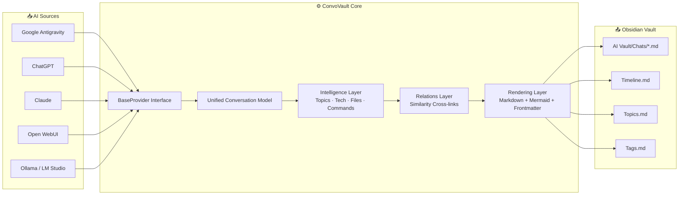
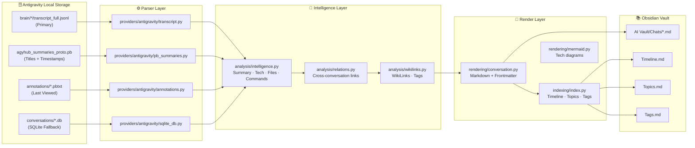
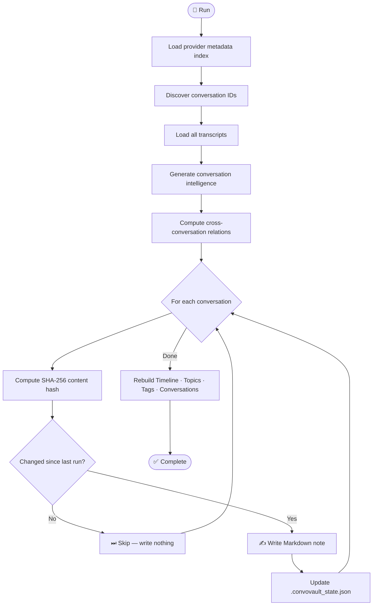

<div align="center">

<a href="https://github.com/owrew/antigravity-obsidian-exporter">
  
</a>

<br/>

# 🗄️ ConvoVault

**Automatically synchronize every AI conversation into your Obsidian knowledge base — with full conversation history, tool calls, AI thinking blocks, wiki-links, timeline indexes, and cross-conversation intelligence. Supports Google Antigravity, ChatGPT, Claude, Ollama, Open WebUI, and more.**

<br/>

[](https://python.org)
[](LICENSE)
[](https://github.com/owrew/antigravity-obsidian-exporter)
[](CHANGELOG.md)
[](https://github.com/owrew/antigravity-obsidian-exporter)
[](tests/)
[](https://obsidian.md)

<br/>

[📖 How It Works](#how-it-works) · [🚀 Quick Start](#quick-start) · [⚙️ CLI Options](#cli-options) · [🔌 Providers](#supported-providers) · [🗺 Roadmap](#roadmap) · [🤝 Contributing](CONTRIBUTING.md)

</div>

---

## 📋 Table of Contents

- [Overview](#overview)
- [Features](#features)
- [Supported Providers](#supported-providers)
- [Architecture](#architecture)
- [Project Structure](#project-structure)
- [Installation](#installation)
- [Quick Start](#quick-start)
- [Configuration](#configuration)
- [Usage](#usage)
- [CLI Options](#cli-options)
- [How It Works](#how-it-works)
- [Data Sources](#data-sources)
- [Export Example](#export-example)
- [Obsidian Integration](#obsidian-integration)
- [Watch Mode](#watch-mode)
- [Performance](#performance)
- [Roadmap](#roadmap)
- [FAQ](#faq)
- [Troubleshooting](#troubleshooting)
- [Contributing](#contributing)
- [License](#license)
- [Credits](#credits)

---

## Overview

**ConvoVault** (originally released as *Antigravity Obsidian Exporter*) is a universal AI conversation archiver and knowledge platform. Born from binary reverse-engineering of Google Antigravity's Protobuf, SQLite, and JSONL local storage formats, it has evolved into a provider-independent platform that syncs conversations from any major AI assistant into a single structured Obsidian vault.

Every conversation becomes a richly formatted Markdown note — complete with YAML frontmatter, wiki-links, auto-generated tags, Mermaid tech-stack diagrams, conversation intelligence, and a global timeline index.

> **No API keys. No network requests. No cloud dependency. 100% local and offline.**

---

## Features

<table>
<thead>
<tr><th>Feature</th><th>Status</th><th>Description</th></tr>
</thead>
<tbody>
<tr><td>💬 Universal provider support</td><td>✅</td><td>Antigravity, ChatGPT, Claude, Ollama, Open WebUI — one tool for all</td></tr>
<tr><td>🔧 Tool call rendering</td><td>✅</td><td>All tool invocations shown with arguments, summaries, and outcomes</td></tr>
<tr><td>📄 Collapsible tool outputs</td><td>✅</td><td>Large outputs kept in <code>&lt;details&gt;</code> blocks with optional truncation</td></tr>
<tr><td>💭 Thinking blocks</td><td>✅</td><td>AI reasoning/planning steps preserved in collapsible sections</td></tr>
<tr><td>💾 SQLite database fallback</td><td>✅</td><td>Raw protobuf BLOBs decoded when JSONL transcripts are missing</td></tr>
<tr><td>🏷️ Auto tagging</td><td>✅</td><td>70+ technology patterns → <code>#tags</code> (e.g. <code>#nextjs</code>, <code>#docker</code>)</td></tr>
<tr><td>🔗 Wiki links</td><td>✅</td><td>Auto-generated <code>[[WikiLinks]]</code> connecting technologies and topics</td></tr>
<tr><td>🔁 SHA-256 sync cache</td><td>✅</td><td>Hash + mtime idempotency — only rewrites what has actually changed</td></tr>
<tr><td>👁 Live watch daemon</td><td>✅</td><td>Instant re-export on file change (watchdog events or polling fallback)</td></tr>
<tr><td>📑 Rich YAML frontmatter</td><td>✅</td><td>id, title, created, updated, duration, step_count, tags, technologies, topics</td></tr>
<tr><td>📅 Global index files</td><td>✅</td><td>Chronological Timeline.md, Topics.md, Tags.md, Conversations.md</td></tr>
<tr><td>🤝 Cross-conversation links</td><td>✅</td><td>Similarity-scored relation detection across shared files, tech, and topics</td></tr>
<tr><td>📊 Mermaid tech-stack diagrams</td><td>✅</td><td>Auto-generated technology flowchart embedded in every note</td></tr>
<tr><td>🧠 Conversation intelligence</td><td>✅</td><td>Auto-extracted topics, technologies, files mentioned, commands executed</td></tr>
<tr><td>🔌 Plugin provider system</td><td>✅</td><td>Register custom providers via Python <code>entry_points</code> — zero core changes</td></tr>
<tr><td>📦 pip installable</td><td>✅</td><td><code>pip install .</code> adds <code>convovault</code> and <code>agy-exporter</code> to PATH</td></tr>
</tbody>
</table>

---

## Supported Providers

| Provider | Status | Source Format | How to Get Your Data |
|---|---|---|---|
| **Google Antigravity** | ✅ Active | Binary Protobuf + JSONL logs | Auto-detected from `%USERPROFILE%\.gemini\antigravity` |
| **ChatGPT** | ✅ Active | `conversations.json` (ZIP export) | Settings → Data Controls → Export Data |
| **Claude.ai** | ✅ Active | `conversations.json` (ZIP export) | Settings → Privacy → Export Data |
| **Open WebUI** | ✅ Active | SQLite database (`webui.db`) | Point directly at your database file |
| **Ollama / LM Studio** | ✅ Active | JSON conversation files | Point at your local conversations folder |
| **Gemini / Google AI** | 🔜 Planned | — | — |
| **LibreChat** | 🔜 Planned | — | — |

---

## Architecture

### Universal Pipeline

ConvoVault separates raw data ingestion from analysis, relations, and rendering into a clean decoupled pipeline:



---

### Google Antigravity — Detailed Source Architecture

The Antigravity provider reads from four parallel local storage systems in priority order to achieve zero-loss exports:



---

### Sync Workflow



---

## Project Structure

```
antigravity-obsidian-exporter/
│
├── convovault/                     # Universal core package
│   ├── __init__.py
│   ├── __main__.py                 # Package entry point
│   │
│   ├── cli/
│   │   └── main.py                 # Subcommand CLI (export, watch, doctor, config, …)
│   │
│   ├── config/
│   │   └── exporter.py             # ExporterConfig dataclass + path resolver
│   │
│   ├── models/
│   │   └── conversation.py         # Data models (Step, Turn, Conversation, …)
│   │
│   ├── providers/                  # Provider plugin implementations
│   │   ├── base.py                 # BaseProvider abstract interface
│   │   ├── plugin_loader.py        # entry_points dynamic loader
│   │   ├── antigravity/            # Google Antigravity (Protobuf + JSONL + SQLite)
│   │   │   ├── provider.py
│   │   │   ├── transcript.py       # JSONL reader (primary source)
│   │   │   ├── pb_summaries.py     # agyhub_summaries_proto.pb parser
│   │   │   ├── annotations.py      # annotations/*.pbtxt last-viewed parser
│   │   │   └── sqlite_db.py        # SQLite + raw protobuf fallback
│   │   ├── chatgpt/                # ChatGPT conversations.json importer
│   │   ├── claude/                 # Claude conversations.json importer
│   │   ├── openwebui/              # Open WebUI webui.db parser
│   │   └── ollama/                 # Ollama & LM Studio JSON loader
│   │
│   ├── analysis/                   # Conversation intelligence pipeline
│   │   ├── intelligence.py         # Topics, tech stack, files, commands, summary
│   │   ├── relations.py            # Cross-conversation similarity scoring
│   │   └── wikilinks.py            # 70+ WikiLink + tag detection patterns
│   │
│   ├── rendering/                  # Markdown generation
│   │   ├── conversation.py         # Full note formatter (frontmatter + body)
│   │   └── mermaid.py              # Tech stack Mermaid diagram generator
│   │
│   ├── indexing/
│   │   └── index.py                # Timeline, Topics, Tags, Conversations indexes
│   │
│   ├── state/
│   │   └── state.py                # Idempotency state (.convovault_state.json)
│   │
│   └── watcher/
│       └── watcher.py              # Watch mode (watchdog events / polling fallback)
│
├── agy_exporter/                   # Backward compatibility shim
│   ├── __init__.py
│   └── __main__.py                 # Redirects all calls to convovault
│
├── tests/                          # Unit test suite (15 tests)
│   ├── test_pb_decoder.py
│   ├── test_transcript.py
│   ├── test_intelligence.py
│   ├── test_wikilinks.py
│   ├── test_markdown.py
│   └── test_relations.py
│
├── examples/
│   ├── example_config.py           # Programmatic configuration example
│   └── sample_export.md            # Sample exported conversation note
│
├── run_tests.py                    # Zero-dependency test runner
├── pyproject.toml                  # Package metadata + build + entry points
├── requirements.txt                # Optional dependencies (watchdog, pytest)
├── .github/workflows/ci.yml        # GitHub Actions CI pipeline
├── README.md
├── CHANGELOG.md
├── CONTRIBUTING.md
├── MIGRATION.md
├── CODE_OF_CONDUCT.md
├── SECURITY.md
└── LICENSE
```

---

## Installation

### Requirements

- Python **3.9+**
- No third-party packages required for core sync functionality

### Option 1 — Install from source (recommended)

```bash
git clone https://github.com/owrew/antigravity-obsidian-exporter.git
cd antigravity-obsidian-exporter
pip install .
```

This adds both `convovault` and the legacy `agy-exporter` command to your PATH.

### Option 2 — Run directly without installing

```bash
git clone https://github.com/owrew/antigravity-obsidian-exporter.git
cd antigravity-obsidian-exporter
python -m convovault --help
```

### Option 3 — Install optional watch mode dependency

```bash
pip install watchdog
```

> Without `watchdog`, watch mode uses a polling fallback — still functional but slightly less responsive.

---

## Quick Start

### Step 1 — Clone the repo

```bash
git clone https://github.com/owrew/antigravity-obsidian-exporter.git
cd antigravity-obsidian-exporter
```

### Step 2 — Find your AI workspace

For **Google Antigravity**, the workspace is the folder containing `brain/` and `conversations/` subdirectories.  
**ConvoVault auto-detects it** — it scans these locations in order:

| Priority | Path checked |
|---|---|
| 1 | Current working directory |
| 2 | `%USERPROFILE%\.gemini\antigravity` ← **Windows default install** |
| 3 | `~/OneDrive/Downloads/OBS` |
| 4 | `~/Downloads/OBS`, `~/Documents/OBS`, `~/Desktop/OBS` |
| 5 | `~/Library/Application Support/Antigravity` *(macOS)* |
| 6 | `~/.antigravity` / `~/.config/antigravity` *(Linux)* |

For **ChatGPT / Claude**: export your data from settings, extract the ZIP, then point `--source` at the `conversations.json` file.

### Step 3 — Save your paths permanently

Run once to lock in your source and vault — you'll never need to type them again:

```bash
python -m convovault config save \
  --source "C:\Users\you\.gemini\antigravity" \
  --vault  "C:\Users\you\Documents\ObsidianVault"
```

This writes to `%APPDATA%\convovault\config.json` (Windows) or `~/.config/convovault/config.json` (macOS/Linux).

> **After `config save`, just run `python -m convovault export` with no arguments.**

### Step 4 — Verify setup

```bash
python -m convovault doctor
```

```
--- ConvoVault Doctor ---
  Active Provider: antigravity
  Source Path: C:\Users\you\.gemini\antigravity — Exists
  Vault Path:  C:\Users\you\Documents\ObsidianVault — Exists
  Provider Resolve: [OK] resolved successfully
  sqlite3: [OK] module is available
  watchdog: [OK] observer available for active watching
```

### Step 5 — Export

```bash
python -m convovault export
```

Open your vault in Obsidian — notes appear under **AI Vault → Chats**.

---

## Configuration

Configuration is resolved in this priority order (highest wins):

```
1. CLI flags        --source / --vault / --provider
2. Environment vars AGY_SOURCE / AGY_VAULT / AGY_PROVIDER
3. Config file      %APPDATA%\convovault\config.json
4. Auto-detection   scans 15+ standard install paths
```

### Option A — Config file (recommended)

```bash
python -m convovault config save --source PATH --vault PATH --provider antigravity
```

The saved config is a plain JSON file you can edit manually:

```json
{
  "source": "C:\\Users\\you\\.gemini\\antigravity",
  "vault":  "C:\\Users\\you\\Documents\\MyVault",
  "provider": "antigravity"
}
```

Show currently resolved paths:

```bash
python -m convovault config show
```

### Option B — Environment variables

Set once in your shell profile (`~/.bashrc`, `~/.zshrc`, PowerShell `$PROFILE`):

```bash
# macOS / Linux
export AGY_SOURCE="$HOME/.gemini/antigravity"
export AGY_VAULT="$HOME/Documents/ObsidianVault"
export AGY_PROVIDER="antigravity"
```

```powershell
# Windows PowerShell
$env:AGY_SOURCE   = "C:\Users\you\.gemini\antigravity"
$env:AGY_VAULT    = "C:\Users\you\Documents\ObsidianVault"
$env:AGY_PROVIDER = "antigravity"
```

### Option C — Pass paths directly each run

```bash
python -m convovault export \
  --source "C:\Users\you\.gemini\antigravity" \
  --vault  "C:\Users\you\Documents\ObsidianVault"
```

---

## Usage

### One-shot export (default)

```bash
python -m convovault export
```

Exports only conversations that changed since the last run (SHA-256 hash + mtime check).

### Continuous sync — watch mode

```bash
python -m convovault watch
# or with a custom polling interval:
python -m convovault watch --interval 2
```

Re-exports any conversation the moment its transcript file is updated on disk.

### Force full rebuild

```bash
python -m convovault export --force
```

Ignores cache — rebuilds every note from scratch.

### Export a specific conversation

```bash
python -m convovault export --conv 45c4c5dc-51af-405e-b45d-35166239f31b
```

### List available subcommands

```bash
python -m convovault --help
```

| Command | Description |
|---|---|
| `export` | Sync conversations to vault (incremental by default) |
| `watch` | Live sync — re-exports instantly on file changes |
| `providers` | List all registered provider plugins |
| `search <query>` | Full-text search across exported Markdown notes |
| `stats` | Show sync cache statistics |
| `doctor` | Run environment health diagnostics |
| `config show` | Print resolved configuration paths |
| `config save` | Save paths to persistent config file |
| `version` | Print ConvoVault version |

### Use a different provider

```bash
# ChatGPT
python -m convovault export --provider chatgpt --source "/path/to/conversations.json"

# Claude
python -m convovault export --provider claude --source "/path/to/conversations.json"

# Open WebUI
python -m convovault export --provider openwebui --source "/path/to/webui.db"

# Ollama / LM Studio
python -m convovault export --provider ollama --source "%APPDATA%\LM Studio\conversations"
```

### Debug configuration issues

```bash
python -m convovault doctor
python -m convovault config show
```

---

## CLI Options

| Flag | Short | Description |
|---|---|---|
| `--source DIR` | `-s` | Source folder, ZIP file, or database path |
| `--vault DIR` | `-v` | Obsidian vault root directory |
| `--provider NAME` | `-p` | Provider: `antigravity`, `chatgpt`, `claude`, `openwebui`, `ollama` |
| `--save` | | Save active paths to config file on this run |
| `--force` | `-f` | Re-export all notes, ignoring hash/mtime cache |
| `--debug` | `-d` | Write decode errors to `.convovault_debug/` |
| `--conv UUID…` | `-c` | Export only the specified conversation UUID(s) |
| `--no-tool-results` | | Omit tool output blocks (produces shorter notes) |
| `--max-tool-results-per-turn N` | | Cap tool result blocks per turn (default: unlimited) |
| `--max-tool-output-length N` | | Cap characters per tool output block (default: unlimited) |
| `--interval SECS` | | Polling interval for watch mode (default: `5.0`) |
| `--verbose` | `-V` | Enable DEBUG-level logging |

---

## How It Works

### Storage Reverse Engineering (Antigravity)

Google Antigravity stores conversations across four parallel local storage systems:

| Path | Format | Used for |
|---|---|---|
| `brain/{id}/.system_generated/logs/transcript_full.jsonl` | JSONL | Full conversation history (**primary source**) |
| `agyhub_summaries_proto.pb` | Binary protobuf | Conversation titles + step counts |
| `annotations/{id}.pbtxt` | Text protobuf | Last-viewed timestamp |
| `conversations/{id}.db` | SQLite + protobuf BLOBs | Fallback when transcript files are missing |

`transcript_full.jsonl` is the richest source — containing clean JSON with every step, tool call, timestamp, thinking block, and content. The `.pb` file is parsed with a **pure-Python varint decoder** (no schema required) to extract titles.

### Idempotency

A `.convovault_state.json` file in the vault root tracks every exported note:

```json
{
  "45c4c5dc-51af-405e-b45d-35166239f31b": {
    "content_hash": "1c923116a132c27d",
    "source_mtime": 1783187693.18,
    "note_path": "AI Vault/Chats/Implementing Financial System Upgrades.md",
    "exported_at": "2026-07-10T14:30:00Z"
  }
}
```

On each run, ConvoVault only rewrites a note if the SHA-256 content hash **or** the source file's `mtime` has changed.

---

## Data Sources

```
Priority 1 ─ transcript_full.jsonl   ← richest source (all steps, timestamps, tools)
Priority 2 ─ agyhub_summaries_proto.pb   ← titles & creation dates
Priority 3 ─ annotations/*.pbtxt    ← last-viewed timestamp
Priority 4 ─ conversations/*.db     ← protobuf fallback decode
```

---

## Export Example

See [`examples/sample_export.md`](examples/sample_export.md) for a full example of an exported conversation note.

**YAML frontmatter:**

```yaml
---
id: "45c4c5dc-51af-405e-b45d-35166239f31b"
title: "Implementing Financial System Upgrades"
created: 2026-06-18
updated: 2026-06-24
last_viewed: 2026-06-24
duration: "2h 14m"
step_count: 1824
user_turns: 87
assistant_turns: 87
tool_calls_total: 623
thinking_blocks: 142
source: "antigravity"
tags:
  - convovault
  - typescript
  - react
  - mysql
  - drizzle-orm
technologies:
  - TypeScript
  - React
  - MySQL
  - Drizzle ORM
topics:
  - Backend Development
  - Database Migration
aliases:
  - "Implementing Financial System Upgrades"
---
```

**Conversation body:**

```
# Implementing Financial System Upgrades

| Field             | Value                            |
| ---               | ---                              |
| Conversation ID   | `45c4c5dc-51af-405e-b45d-...`    |
| Created           | 2026-06-18                       |
| Duration          | 2h 14m                           |
| Total Steps       | 1,824                            |
| Source            | Antigravity (Google)             |

## 📊 Conversation Statistics

| Metric              | Count |
| ---                 | ---   |
| 👤 User Turns       | 87    |
| 🤖 Assistant Turns  | 87    |
| 💭 Thinking Blocks  | 142   |
| 🔧 Tool Calls       | 623   |

## 🗺️ Tech Stack

graph TD
    TypeScript --> React
    React --> MySQL
    MySQL --> DrizzleORM[Drizzle ORM]

## 🔗 Related Conversations

[[Drizzle Migration Setup]] · [[React Auth Module]] · [[Railway Deployment]]

## 💬 Conversation History

### 👤 User — Turn 1 *(2026-06-18 14:38)*

Complete the task at CODEX_PROMPT.md…

### 🤖 Assistant — Turn 1 *(2026-06-18 14:38)*

> 🔧 **`view_file`** — Reading CODEX_PROMPT.md

<details>
<summary>📄 VIEW_FILE (step 2)</summary>

```json
{ "output": "# CODEX_PROMPT\n..." }
```

</details>

<details>
<summary>💭 Thinking Process</summary>

Let me analyze the financial system requirements...
</details>

I'll implement this in phases. First, let's define the Drizzle schema...
```

---

## Obsidian Integration

### Vault Layout

```
Your Vault/
├── AI Vault/
│   ├── Chats/
│   │   ├── Implementing Financial System Upgrades.md
│   │   ├── Fixing EAS CLI Setup.md
│   │   ├── React Native RTL Layout.md
│   │   └── … (one note per conversation)
├── Timeline.md       ← Chronological index of all conversations
├── Conversations.md  ← Master table with full metadata
├── Topics.md         ← Conversations grouped by topic
└── Tags.md           ← Conversations grouped by technology tag
```

### Recommended Obsidian Plugins

| Plugin | Why |
|---|---|
| **Dataview** | Query conversations by date, technology, or topic with SQL-like syntax |
| **Graph View** | Visualize wiki-link connections between conversations |
| **Templater** | Customize note templates and layouts |
| **Tag Wrangler** | Manage and rename the auto-generated technology tags |

### Graph View Tips

ConvoVault maximises graph density by:

- Linking all conversations to shared technology nodes (`[[React]]`, `[[Docker]]`, etc.)
- Auto-detecting related conversations and adding `Related Conversations` wiki-links
- Using consistent titles across index files and note bodies

### Dataview Queries

After installing the Dataview plugin, use these queries in any Obsidian note:

#### Recent Conversations
```sql
TABLE created AS Created, step_count AS Steps, technologies AS Tech
FROM "AI Vault/Chats"
SORT created DESC
LIMIT 10
```

#### Filter by Technology
```sql
TABLE created AS Created, title AS Title
FROM "AI Vault/Chats"
WHERE contains(technologies, "PostgreSQL")
SORT created DESC
```

#### Conversations with Most Tool Calls
```sql
TABLE tool_calls_total AS "Tool Calls", user_turns AS Turns
FROM "AI Vault/Chats"
SORT tool_calls_total DESC
LIMIT 20
```

---

## Watch Mode

When you run `python -m convovault watch`, the exporter:

1. Does a full sync pass immediately on startup
2. Monitors `brain/*/transcript_full.jsonl` for file changes
3. Re-exports only the changed conversation — completes in seconds
4. Rebuilds all index files (Timeline, Topics, Tags, Conversations)

If **watchdog** is installed, file events are instant. Otherwise, polling runs every `--interval` seconds (default: `5.0`).

```bash
# Install watchdog for instant event-based updates
pip install watchdog

# Run with 2-second polling fallback
python -m convovault watch --interval 2
```

---

## Performance

| Conversations | First run | Subsequent runs |
|---|---|---|
| 12 | ~8 seconds | ~0.5 seconds (all skipped) |
| 100 | ~45 seconds | ~1.5 seconds |
| 500 | ~4 minutes | ~3 seconds |
| 1,000 | ~8 minutes | ~5 seconds |

Subsequent runs are fast because unchanged conversations are detected by SHA-256 hash + mtime and skipped entirely before any Markdown generation or disk writes.

---

## Roadmap

### Completed ✅

- [x] JSONL transcript parsing with full tool call and thinking block support
- [x] Pure-Python protobuf parser (no schema, no protoc required)
- [x] SQLite + raw protobuf blob fallback decoder
- [x] Rich YAML frontmatter with all metadata fields
- [x] Automatic wiki-links (70+ technology patterns)
- [x] Tool call + output rendering with collapsible blocks
- [x] Thinking block support
- [x] SHA-256 hash + mtime idempotency cache
- [x] Watch mode (watchdog events + polling fallback)
- [x] Timeline, Topics, Tags, Conversations global indexes
- [x] Cross-conversation relation detection and wiki-linking
- [x] Conversation intelligence (topics, tech, files, commands)
- [x] Mermaid tech-stack diagrams per note
- [x] pip installable package (`convovault` + `agy-exporter`)
- [x] 15-test unit test suite
- [x] GitHub Actions CI pipeline (lint + tests)
- [x] Multi-provider architecture (ChatGPT, Claude, Ollama, Open WebUI)
- [x] Plugin system via Python `entry_points`
- [x] Subcommand CLI (export, watch, doctor, config, stats, search)
- [x] 4-level configuration resolution with auto-detection

### Planned 📋

- [ ] `--since DATE` flag to export only recent conversations
- [ ] Gemini / Google AI provider
- [ ] LibreChat provider
- [ ] Cursor / Cline provider
- [ ] Semantic embeddings for smarter relation detection (local Ollama)
- [ ] Optional AI-generated summaries
- [ ] Canvas `.canvas` file generation (Obsidian Canvas view)
- [ ] Full-text search index (compatible with Obsidian Search)
- [ ] HTML export format
- [ ] PDF export format
- [ ] Daily Notes integration
- [ ] MCP server integration
- [ ] Web UI dashboard

---

## FAQ

**Q: Does this require a Google account or API key?**  
A: No. Everything runs entirely locally — no network requests are made at any point.

**Q: Will it work on macOS or Linux?**  
A: Yes. All paths use `os.path.expanduser("~")` and are fully platform-independent.

**Q: Is it safe to run while Antigravity is open?**  
A: Yes. ConvoVault only reads files — it never writes to the Antigravity workspace.

**Q: Why do some notes show partial content or "SQLite fallback"?**  
A: Very short or aborted conversations may not have a `transcript_full.jsonl` yet. The SQLite fallback decodes raw protobuf BLOBs but may produce partial content. Run `--debug` to inspect details in `.convovault_debug/`.

**Q: Can I run it on a schedule (e.g., every hour)?**  
A: Yes — use `--watch` for continuous sync, or add the export command to Task Scheduler (Windows) / cron (Linux/macOS).

**Q: My vault is in a different folder from my workspace. How do I set it up?**  
A: Use `--source /path/to/workspace --vault /path/to/vault`, or save it once with `config save`.

**Q: Will it overwrite notes I have edited manually?**  
A: Only if the source transcript changed. The SHA-256 hash check prevents rewrites for unchanged conversations, so manual edits are safe as long as the source doesn't update.

**Q: I was using `agy_exporter` — do I need to change anything?**  
A: No. `python -m agy_exporter` still works as a full redirect to ConvoVault. See [MIGRATION.md](MIGRATION.md) for details.

---

## Troubleshooting

**`No conversations discovered`**  
→ Verify `--source` points to a folder containing `brain/` and `conversations/` (for Antigravity), or directly to the correct file for other providers.

**`Titles showing as UUID fragments`**  
→ `agyhub_summaries_proto.pb` may be missing or corrupt. Titles fall back to the first user message automatically.

**`SQLite fallback, content may be partial`**  
→ Expected for very short conversations. Run `--debug` to inspect decode details in `.convovault_debug/`.

**`Watch mode isn't reacting instantly`**  
→ Install `pip install watchdog` for event-based watching instead of polling.

**`Windows encoding errors in terminal`**  
→ ConvoVault wraps stdout in UTF-8. If you still see errors, run `chcp 65001` before starting.

**`Provider not found` error**  
→ Run `python -m convovault providers` to list all registered providers. Ensure your provider name is spelled correctly.

---

## Contributing

Contributions are welcome! Please read [CONTRIBUTING.md](CONTRIBUTING.md) before opening a pull request.

The easiest contribution is implementing a new provider. Quick steps:

1. Fork the repository
2. Create a feature branch (`git checkout -b feat/my-provider`)
3. Subclass `BaseProvider` from `convovault/providers/base.py`
4. Register it in `pyproject.toml` under `[project.entry-points."convovault.providers"]`
5. Add tests under `tests/` — all 15 existing tests must still pass
6. Run `python run_tests.py` — all must pass
7. Open a PR with a description of the new provider

---

## License

This project is licensed under the **MIT License** — see [LICENSE](LICENSE) for details.

MIT was chosen because:
- It is permissive and business-friendly
- It allows use in commercial and private tools
- It requires only attribution
- It is the most common license for Python tooling projects

---

## Credits

Built and maintained by **[Owais Ali](https://github.com/owrew)**.

Special thanks to the Antigravity team at Google DeepMind for building such a capable AI coding assistant, and to the Obsidian community for making personal knowledge management genuinely exciting.

---

<div align="center">

**If this project is useful to you, please consider giving it a ⭐ on GitHub!**

[](https://github.com/owrew/antigravity-obsidian-exporter)

<br/>

*Made with ❤️ and too much reverse engineering*

</div>
