<div align="center">

<!-- HEADER -->


**The open-source knowledge vault for your AI conversations.**

[](https://github.com/owrew/antigravity-obsidian-exporter/actions/workflows/ci.yml)
[](https://python.org)
[](LICENSE)
[](#-supported-providers)
[](tests/)
[](https://obsidian.md)

ConvoVault automatically **imports, synchronizes, indexes, and connects** conversations from multiple AI assistants into a single Obsidian knowledge base — preserving every message, reasoning block, tool call, code snippet, and file reference in publication-quality Markdown.

</div>

---

## 📸 What You Get

Every exported conversation becomes a structured Obsidian note like this:

```
---
id: "f4fe6955-c86a-4886-..."
title: "Building a Financial System"
created: 2026-06-15
technologies:
  - Next.js
  - PostgreSQL
  - Drizzle ORM
topics:
  - Backend
  - Authentication
tags:
  - convovault
  - nextjs
  - drizzle-orm
---

# Building a Financial System

| Field             | Value                        |
| ---               | ---                          |
| Conversation ID   | `f4fe6955-c86a-4886-...`     |
| Created           | 2026-06-15                   |
| Duration          | 2h 14m                       |
| Total Steps       | 4,759                        |

## 📊 Conversation Statistics

| Metric            | Count |
| ---               | ---   |
| 👤 User Turns     | 87    |
| 🤖 Assistant Turns| 87    |
| 💭 Thinking Blocks| 142   |
| 🔧 Tool Calls     | 623   |

## 🗺️ Technology Map

graph LR
    A[Next.js] --> B[PostgreSQL]
    B --> C[Drizzle ORM]
    A --> D[Tailwind CSS]

## 🔗 Related Conversations

[[Drizzle Migration]] · [[Auth Setup]] · [[Railway Deploy]]

## 💬 Conversation History

### 👤 User — Turn 1 · 2026-06-15 09:42

Build me a full financial management system with...

### 🤖 Assistant — Turn 1 · 2026-06-15 09:43

<details>
<summary>💭 Thinking Process</summary>

Let me break this down into phases...
</details>

I'll build this in phases. First, let's set up the schema...
```

---

## ✨ Features

| Feature | Description |
|---|---|
| **📥 Universal Import** | One platform for every major AI provider |
| **🔄 Incremental Sync** | Only processes new/changed conversations |
| **🧠 Intelligence Extraction** | Auto-detects technologies, topics, files, commands |
| **🕸️ Graph Relationships** | Cross-links conversations by shared content |
| **🗺️ Global Indexes** | Timeline, Tags, Topics, Conversations dashboards |
| **💬 Complete Archive** | Every turn, thinking block, tool call, and output preserved |
| **📊 Mermaid Tech Graphs** | Visual tech stack diagram per conversation |
| **👀 Watch Mode** | Live sync — re-exports on file changes automatically |
| **🔌 Plugin System** | Add new providers via Python entry points |
| **⚡ Fast** | SHA-256 change detection, skips unchanged conversations |

---

## 🤖 Supported Providers

| Provider | Status | Data Source | How to Export |
|---|---|---|---|
| **Google Antigravity** | ✅ Active | Auto-detected | Auto-detected from `~/.gemini/antigravity` |
| **ChatGPT** | ✅ Active | `conversations.json` | Settings → Data Controls → Export Data |
| **Claude.ai** | ✅ Active | `conversations.json` | Settings → Privacy → Export Data |
| **Open WebUI** | ✅ Active | `webui.db` SQLite | Direct file path |
| **Ollama / LM Studio** | ✅ Active | JSON chat folders | Direct folder path |
| **Gemini** | 🔜 Planned | — | — |
| **LibreChat** | 🔜 Planned | — | — |

---

## ⚡ Quick Start

### Step 1 — Clone

```bash
git clone https://github.com/owrew/antigravity-obsidian-exporter.git
cd antigravity-obsidian-exporter
```

### Step 2 — Run

```bash
python -m convovault export
```

ConvoVault automatically detects your Antigravity workspace from these locations (in order):

| Priority | Path |
|---|---|
| 1st | Current working directory |
| 2nd | `%USERPROFILE%\.gemini\antigravity` ← **default install** |
| 3rd | `%USERPROFILE%\OneDrive\Downloads\OBS` |
| 4th | `%USERPROFILE%\Downloads\OBS`, `Documents\OBS`, `Desktop\OBS` |
| … | 10 more standard paths |

### Step 3 — Save config once (recommended)

```bash
python -m convovault config save --source "C:\Users\you\.gemini\antigravity" --vault "C:\Users\you\Documents\MyVault"
```

After this, just run `python -m convovault export` — no flags needed.

---

## 🛠️ Usage

### Subcommands

```
python -m convovault <command> [options]
```

| Command | Description |
|---|---|
| `export` | Export all conversations to the Obsidian vault |
| `watch` | Live sync — re-exports on file changes |
| `providers` | List all registered providers |
| `search <query>` | Full-text search across exported notes |
| `stats` | Show sync statistics |
| `doctor` | Run environment health diagnostics |
| `config show` | Show current configuration |
| `config save` | Save configuration to file |
| `version` | Show version |

### Export a specific conversation

```bash
python -m convovault export --conv f4fe6955-c86a-4886-8771-a41b7931c132
```

### Force rebuild all notes

```bash
python -m convovault export --force
```

### Watch mode (live sync)

```bash
python -m convovault watch
# or with interval:
python -m convovault watch --interval 10
```

### Use a different provider

```bash
# ChatGPT export
python -m convovault export --provider chatgpt --source "C:\path\to\conversations.json"

# Claude export
python -m convovault export --provider claude --source "C:\path\to\conversations.json"

# Open WebUI
python -m convovault export --provider openwebui --source "C:\path\to\webui.db"

# Ollama / LM Studio
python -m convovault export --provider ollama --source "%APPDATA%\LM Studio\conversations"
```

### Trim output size

```bash
# Skip tool result blocks entirely
python -m convovault export --no-tool-results

# Show max 3 tool results per turn
python -m convovault export --max-tool-results-per-turn 3

# Truncate long outputs at 2000 characters
python -m convovault export --max-tool-output-length 2000
```

### All flags

| Flag | Short | Description |
|---|---|---|
| `--source DIR` | `-s` | Source folder or file path |
| `--vault DIR` | `-v` | Obsidian vault root folder |
| `--provider NAME` | `-p` | Provider: `antigravity`, `chatgpt`, `claude`, `ollama`, `openwebui` |
| `--save` | | Save these paths to config file |
| `--force` | `-f` | Rebuild all notes ignoring cache |
| `--debug` | `-d` | Write decode errors to `.convovault_debug/` |
| `--conv UUID…` | `-c` | Export specific conversation UUID(s) only |
| `--no-tool-results` | | Omit tool output blocks |
| `--max-tool-results-per-turn N` | | Cap tool result blocks per turn |
| `--max-tool-output-length N` | | Cap characters per tool output block |
| `--verbose` | `-V` | Enable DEBUG logging |

---

## ⚙️ Configuration

Configuration is resolved in this priority order:

```
1. CLI flags        --source / --vault / --provider
2. Environment      AGY_SOURCE / AGY_VAULT / AGY_PROVIDER
3. Config file      %APPDATA%\convovault\config.json
4. Auto-detect      scans 15+ standard install paths
```

### Save config once

```bash
python -m convovault config save \
  --source "C:\Users\you\.gemini\antigravity" \
  --vault  "C:\Users\you\Documents\MyVault"
```

### Show active configuration

```bash
python -m convovault config show
```

### Environment variables

```powershell
# Windows PowerShell
$env:AGY_SOURCE   = "C:\Users\you\.gemini\antigravity"
$env:AGY_VAULT    = "C:\Users\you\Documents\MyVault"
$env:AGY_PROVIDER = "antigravity"
```

```bash
# Linux / macOS
export AGY_SOURCE="$HOME/.gemini/antigravity"
export AGY_VAULT="$HOME/ObsidianVault"
```

---

## 📁 Vault Output Structure

```
ObsidianVault/
│
├── AI Vault/
│   └── Chats/
│       ├── Building a Financial System.md
│       ├── Fixing EAS CLI Issue.md
│       ├── React Native RTL Layout.md
│       └── ...
│
├── Timeline.md        ← Full chronological event log
├── Conversations.md   ← Complete metadata table
├── Tags.md            ← Grouped by technology tags
└── Topics.md          ← Grouped by topic domains
```

### What each note contains

```
📄 note.md
├── YAML Frontmatter        — id, provider, title, date, duration, technologies, topics, tags
├── Metadata Table          — human-readable stats grid
├── Conversation Statistics — turn counts, tool call breakdown
├── 🗺️ Technology Map       — Mermaid graph of detected technologies
├── 🔗 Related Conversations — cross-linked by shared files/tech/topics
├── 💬 Conversation History
│   ├── User turns          — cleaned of system metadata, with timestamps
│   ├── Assistant turns     — full response content
│   ├── 💭 Thinking blocks  — collapsible <details> sections
│   ├── 🔧 Tool calls       — name, summary, all arguments
│   └── 📄 Tool results     — full output in syntax-highlighted code blocks
├── Files Mentioned         — all file paths referenced
├── Commands Executed       — all terminal commands run
└── Conversation Intelligence — auto-generated summary
```

---

## 🏗️ Architecture

```mermaid
flowchart LR
    subgraph Sources["📥 AI Sources"]
        A1[Google Antigravity]
        A2[ChatGPT]
        A3[Claude]
        A4[Ollama]
        A5[Open WebUI]
    end

    subgraph Core["⚙️ ConvoVault Core"]
        B[BaseProvider Interface]
        C[Unified Conversation Model]
        D[Analysis Pipeline]
        E[Rendering Pipeline]
    end

    subgraph Output["📤 Obsidian Vault"]
        F["AI Vault/Chats/*.md"]
        G[Timeline.md]
        H[Topics.md]
        I[Tags.md]
    end

    Sources --> B --> C --> D --> E --> Output
```



---

## 🔌 Adding a New Provider

Implement the `BaseProvider` interface:

```python
from convovault.providers.base import BaseProvider
from convovault.models import Conversation, ConversationMeta
from convovault.config.exporter import ExporterConfig
from typing import List, Dict, Optional

class MyProvider(BaseProvider):
    @property
    def name(self) -> str:
        return "myprovider"

    def discover_conversations(self, config: ExporterConfig) -> List[str]:
        return []  # Return list of conversation IDs

    def read_conversation(self, conv_id: str, config: ExporterConfig) -> Optional[Conversation]:
        return None  # Read and return a Conversation

    def load_metadata_index(self, config: ExporterConfig) -> Dict[str, ConversationMeta]:
        return {}  # Return {conv_id: ConversationMeta}
```

Register via `pyproject.toml`:

```toml
[project.entry-points."convovault.providers"]
myprovider = "my_package.provider:MyProvider"
```

---

## 🗺️ Roadmap

### v2.1 *(current)*
- [x] Multi-provider architecture
- [x] Google Antigravity provider (full feature parity)
- [x] ChatGPT, Claude, Ollama, Open WebUI providers
- [x] Archive-quality note rendering (thinking, tools, code)
- [x] 4-level config resolution with auto-detection
- [x] Plugin system via Python entry points
- [x] Subcommand CLI
- [x] GitHub Actions CI/CD

### v2.2 *(planned)*
- [ ] Gemini provider
- [ ] LibreChat provider
- [ ] Cursor / Cline providers
- [ ] Full-text search index
- [ ] Canvas generation (Obsidian Canvas)
- [ ] HTML export

### v3.0 *(future)*
- [ ] Semantic embeddings + local vector search
- [ ] AI-generated summaries
- [ ] MCP server integration
- [ ] Web UI dashboard
- [ ] PDF export

---

## 🛟 Troubleshooting

**Nothing is being exported:**
```bash
python -m convovault doctor          # Check all paths and config
python -m convovault config show     # See what paths are resolved
```

**Notes are stale / not updating:**
```bash
python -m convovault export --force  # Force full rebuild
```

**Provider not recognized:**
```bash
python -m convovault providers       # List all available providers
```

**Migrating from `agy_exporter`:**
- See [MIGRATION.md](MIGRATION.md) — backward compatibility is fully preserved.
- `python -m agy_exporter` still works as a redirect.

---

## 🤝 Contributing

All contributions are welcome! The easiest way to contribute is to implement a new provider — see the plugin guide above.

Please read [CONTRIBUTING.md](CONTRIBUTING.md) before opening a PR.

---

## 📜 License

MIT — see [LICENSE](LICENSE).

---

<div align="center">

**[⭐ Star this project](https://github.com/owrew/antigravity-obsidian-exporter)** if ConvoVault helps you archive your AI conversations!

**[🐛 Report a bug](https://github.com/owrew/antigravity-obsidian-exporter/issues/new?template=bug_report.md)** · **[💡 Request a feature](https://github.com/owrew/antigravity-obsidian-exporter/issues/new?template=feature_request.md)** · **[🔌 Request a provider](https://github.com/owrew/antigravity-obsidian-exporter/issues/new?template=provider_request.md)**

*Made with ❤️ by [@owrew](https://github.com/owrew)*

</div>
