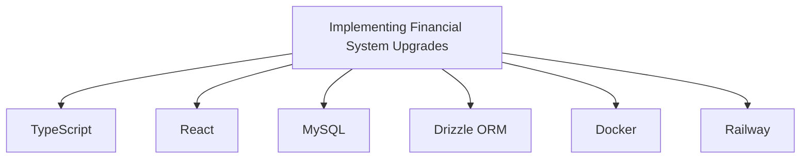

# Implementing Financial System Upgrades

| Metadata | Value |
| --- | --- |
| **Created** | 2026-06-18 |
| **Updated** | 2026-06-24 |
| **Last Viewed** | 2026-06-24 |
| **Steps** | 1824 |

## 📋 Summary

The user requested to: Complete the task at CODEX_PROMPT.md and implement the full financial monitoring upgrade. During execution, the assistant worked on reading CODEX_PROMPT.md, viewing schema.ts, editing routers.ts, among other actions.

## 📊 Tech Graph



## 💬 Conversation History

### 👤 User — Turn 1 *(2026-06-18 14:38)*

Complete the task at `CODEX_PROMPT.md`. Implement the full financial monitoring
system upgrade including the new capital management page, role-based access,
and the revised transaction schema.

### 🤖 Assistant — Turn 1 *(2026-06-18 14:38)*

> 🔧 **`view_file`** — Reading CODEX_PROMPT.md
>   - **AbsolutePath:** `logo/CODEX_PROMPT.md`

<details>
<summary>📄 Tool result: <code>VIEW_FILE</code></summary>

```
# Implementation Prompt — Financial Monitor Upgrade
...
```
</details>

Let me start by reviewing the full prompt and then reading all relevant source files.

> 🔧 **`view_file`** — Drizzle schema
>   - **AbsolutePath:** `drizzle/schema.ts`

---

## 🧠 Conversation Intelligence

* **Technologies:** [[TypeScript]], [[React]], [[MySQL]], [[Drizzle ORM]], [[Docker]], [[Railway]]
* **Topics:** [[Database Migration]], [[API Development]], [[Authentication]], [[Deployment]]
* **Code Languages:** TypeScript, SQL
* **Files Mentioned:** `schema.ts`, `routers.ts`, `Dashboard.tsx`, `package.json`
* **Related Chats:** [[Reviewing Financial Monitoring Codebase]], [[Inspecting Financial Monitor Codebase]]

*Exported by Antigravity Exporter v2 · ID: `45c4c5dc-51af-405e-b45d-35166239f31b`*
